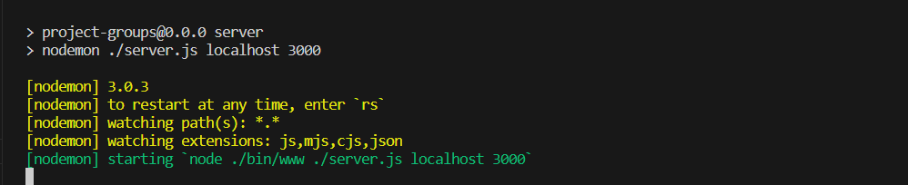

# Backend - Optimi Assessment

A basic Express.js REST API that returns records from a data.js file on the endpoint http://localhost:3000/projects

## Installation

```sh
npm install
```

## Usage example

Run the application, it uses nodemon for live reloads.

```sh
npm run server
```
Once the command is done running you should see this on your terminal.



Next you can install the frontend.
